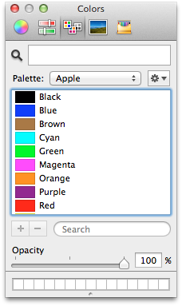
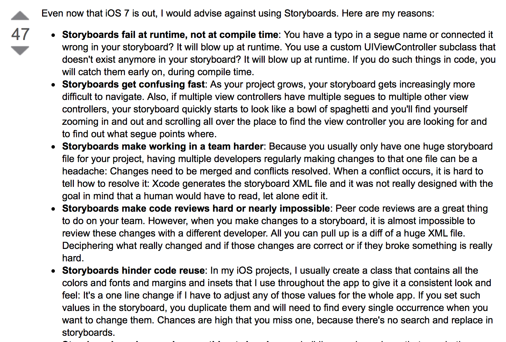

# codegenutils

We love Xcode 5. It's been adding way cool features at a really fast pace, and adopting these features is the quickest way to bliss in life.

(Or at least iOS development bliss.)

But sometimes these boss new features don't quite get all the way. In the interest of meeting the tools halfway, we present three small code generators to improve your life in subtle ways.

## objc-assetgen

Xcode 5 has an awesome new feature called "[asset catalogs](https://developer.apple.com/technologies/tools/features.html)", allowing you to specify all of your image variants and resizable cap insets in a single place.

Unfortunately, to get the full benefits, you have to set your deployment target to iOS 7; otherwise, Xcode will dutifully put all of the images into your app bundle but totally ignore all of your resizable insets with only a build warning.

And even if you're targeting iOS 7, you'll still have to deal with typing string filenames correctly. And [everybody knows that stringly-typed code is bad.](http://c2.com/cgi/wiki?StringlyTyped) (While you're at it, consider replacing your stringly-typed key paths with [a macro to check them at compile time!](https://gist.github.com/kyleve/8213806))

But shucks! The important and awesome part is the editor, and it puts all of the data out in super-readable JSON. We should be able to do a poor man's version that reads in the data and spits out some code to give you most of the benefits.

### Usage

Call `objc-assetgen` with the `.xcassets` paths as arguments from the directory into which it should output the code.

For an asset catalog named "Foo" containing image sets "Bar" and "Baz", you'll get `FooCatalog.h` and `FooCatalog.m`, with class methods `+ (UIImage *)barImage` and `+ (UIImage *)bazImage`. Put them in your DerivedSources folder and you're good to go.

## objc-colordump

On Mac OS X, the standard system color picker has a tab for palette-based colors:



One little-known feature of this color picker tab is that you can create your own palettes and fill them with the custom colors for your app.

In the spirit of [Once and Only Once](http://c2.com/cgi/wiki?OnceAndOnlyOnce), once you've used these colors in your storyboards and nib files, you won't want to have to define them again for that rare occasion you're using them in code. Luckily, your custom color palettes are just files in `~/Library/Colors`, and we can read them and give your app access to them.

Running the tool will also install the palette into your system color picker, so the other developers on your team can use your colors in their storyboards.

### Usage

Call `objc-colordump` with the `.clr` paths as arguments from the directory into which it should output the code.

For a color palette named "Foo" colors named "Bar" and "Baz", you'll get `FooColorList.h` and `FooColorList.m`, with class methods `+ (UIColor *)barColor` and `+ (UIColor *)bazColor`. Put them in your DerivedSources folder and you're good to go.

## objc-identifierconstants

[Storyboards](https://developer.apple.com/library/ios/documentation/general/conceptual/Devpedia-CocoaApp/Storyboard.html) are great. They let you visually lay out your interface and define the interactions between different screens in a way that's much more compact than writing a ton of view code.

At least I think so. But if you go and search for more information on storyboards, one of the first things you'll find is this Stack Overflow answer:

[](http://stackoverflow.com/a/19457257/6010)

We already fixed the part about code reuse with `objc-colordump`, and now we can fix the parts about failures at runtime. If we generate some code to turn your string identifiers—and that's any kind of string identifier, be it a view controller identifier, a segue identifier, or a cell reuse identifier—into compiler-checked constants, we can avoid a whole class of problems.

### Usage

Call `objc-identifierconstants` with the `.storyboard` paths as arguments from the directory into which it should output the code.

For a storyboard named "Foo", you'll get `FooStoryboardIdenfitiers.h` and `FooStoryboardIdentifiers.m`. Put them in your DerivedSources folder and you're good to go.

The tool will first attempt to add category methods on your existing view controller subclasses. If it does not find a given class, it resorts to outputting constants. For example, a segue identifier "Baz" will generate `extern NSString *const FooStoryboardBazIdentifier`.

### Examples

#### Storyboard scenes

```objective-c
// old way:
UIStoryboard *storyboard = [UIStoryboard storyboardWithName:@"MainStoryboard" bundle:nil];
id viewController = [storyboard instantiateViewControllerWithIdentifier:@"Detail View Controller"];

// new way:
MYDetailViewController *detailViewController = [MYMainStoryboard instantiateDetailViewController];
```

#### Segues

```objective-c
// old way:
[self performSegueWithIdentifier:@"Show Details" sender:nil];

// new way:
[self performShowDetailsSegue];
```

#### Table view cells

```objective-c
// old way:
id cell = [tableView dequeueReusableCellWithIdentifier:@"Image cell" forIndexPath:indexPath];

// new way:
MYImageCell *imageCell = [self dequeueImageCellForIndexPath:indexPath ofTableView:tableView];
```

#### Auto Layout constraint constants

```objective-c
// old way:
self.labelHeightConstraint.constant = showLabel ? 40.0f : 0.0f;

// new way:
self.labelHeightConstraint.constant = showLabel ? [self labelHeightConstraintOriginalConstant] : 0.0f;
```

#### Other features

```objective-c
// getting a storyboard
UIStoryboard *storyboard = [MYCustomStoryboard storyboard];

// instantiate initial storyboard view controller
MYCustomViewController *viewController = [MYCustomStoryboard instantiateInitialViewController];

// getting segue identifier
NSString *segueID = [self <#segueID#>SegueIdentifier];

// getting cell/view identifier (for UITableView or UICollectionView)
NSString *cellID = [self <#cellID#>Identifier];

// dequeue collection view reusable cell
MYCustomCell *cell = [self dequeue<#cellID#>CellForIndexPath:indexPath ofCollectionView:collectionView];

// dequeue collectiov view reusable view 
MYCustomView *view = [self dequeue<#viewID#>ViewForIndexPath:indexPath ofKind:kind ofCollectionView:collectionView];
```

**Note:** in the above examples, `self` refers to a subclass of UIViewController.

## Command-line options (common to all three tools)

Usage:
* `objc-assetgen [-6] [-o <path>] [-f <path>] [-p <prefix>] [<paths>]`
* `objc-colordump [-6] [-o <path>] [-f <path>] [-p <prefix>] [<paths>]`
* `objc-identifierconstants [-6] [-o <path>] [-f <path>] [-p <prefix>] [<paths>]`

Options:
<dl>
<dt><code>-6</code></dt><dd>Target iOS 6 in addition to iOS 7</dd>
<dt><code>-o &lt;path></code></dt><dd>Output files at <code>&lt;path></code></dd>
<dt><code>-f &lt;path></code></dt><dd>Search for input files starting from <code>&lt;path></code></dd>
<dt><code>-p &lt;prefix></code></dt><dd>Use <code>&lt;prefix></code> as the class prefix in the generated code</dd>
<dt><code>-h</code></dt><dd>Print this help and exit</dd>
<dt><code>&lt;paths></code></dt><dd>Input files; this and/or `-f` are required.</dd>
</dl>

## Contributing

We're glad you're interested in codegenutils, and we'd love to see where you take it.

Any contributors to the master codegenutils repository must sign the [Individual Contributor License Agreement (CLA)](https://spreadsheets.google.com/spreadsheet/viewform?formkey=dDViT2xzUHAwRkI3X3k5Z0lQM091OGc6MQ&ndplr=1). It's a short form that covers our bases and makes sure you're eligible to contribute.

When you have a change you'd like to see in the master repository, [send a pull request](https://github.com/square/objc-codegenutils/pulls). Before we merge your request, we'll make sure you're in the list of people who have signed a CLA.

Thanks, and happy generating!
